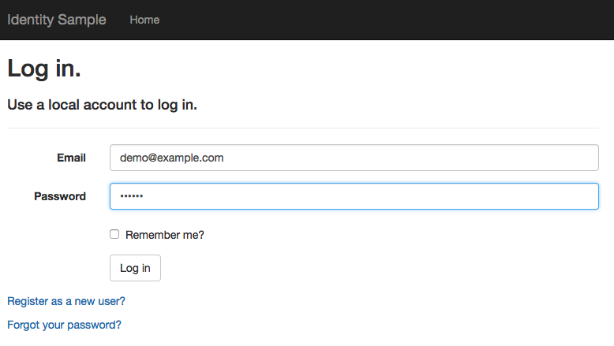
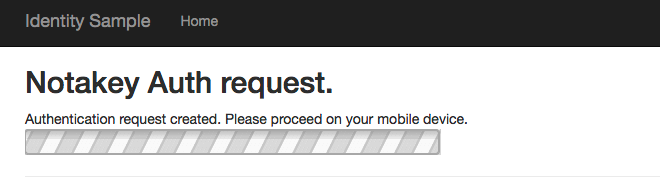
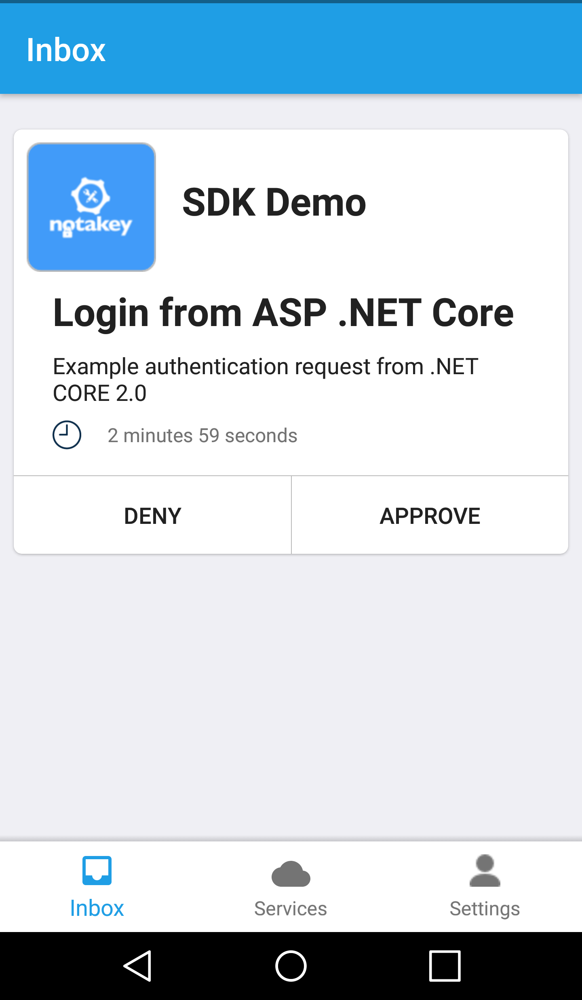
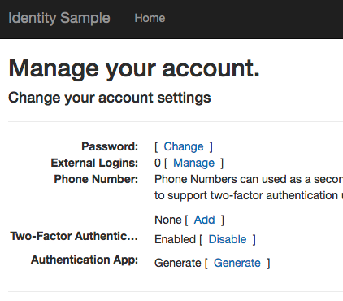

# Notakey ASP.NET Core Identity example integration

Project showcasing Microsoft.AspNetCore.Identity 2FA integration possibilities. 

Install .NET Core from [here](https://www.microsoft.com/net/download/core), version >= 2.0.

Original project from official ASP.NET Core Identity project can be found [here](https://github.com/aspnet/Identity/tree/dev/samples/IdentitySample.Mvc). 

## Installing Notakey.SDK

The application relies on the NuGet package version >= 1.1.49 [Notakey.SDK](https://www.nuget.org/packages/Notakey.SDK/). To install dependencies
issue `dotnet restore` before running. 

## Running 

Run the application using `dotnet run` in project root or use Visual Studio.

## Using the SDK

To use it, you need:

- a valid Notakey server API endpoint
- a valid Notakey application AccessId value (on the same server)
- an onboarded user, which can approve authentication requests in this application

## Demo environment

For testing, we have provided a default (shared) environment:

- service domain demo.notakey.com
- application .NET SDK Demo (with AccessId 235879a9-a3f3-42b4-b13a-4836d0fd3bf8)
- user 'demo@example.com' with password 'asdllkj' 

After onboarding this user in the Notakey Authenticator mobile application, and running this demo, you should
receive authentication requests. Add service domain demo.notakey.com in Notakey Authenticator mobile application 
to see service in available list. 

## Storage options

For demo purposes project comes with in-memory database backend. All users and changes will be lost after 
application is stopped. For production setup you would need to add connection 
to persistent relational database e.g. MS SQL server.  

## Screenshots

